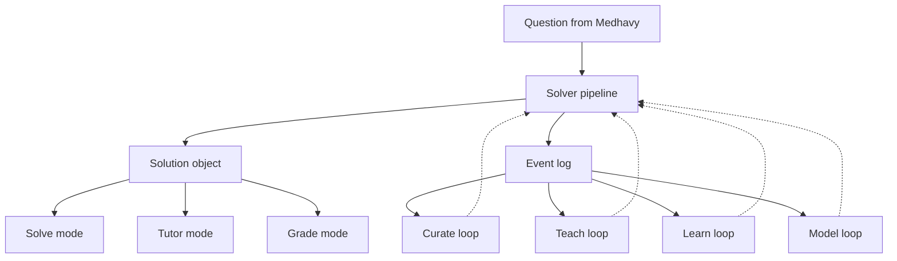
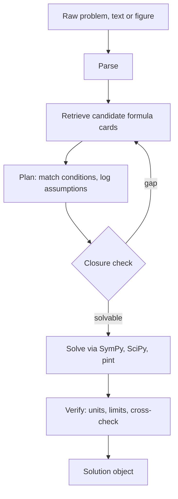
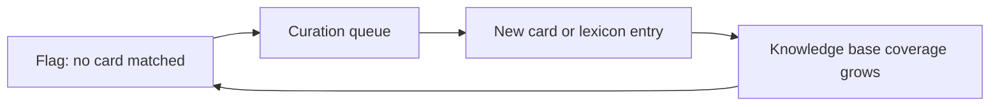
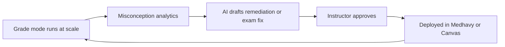
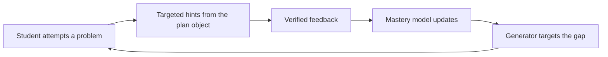
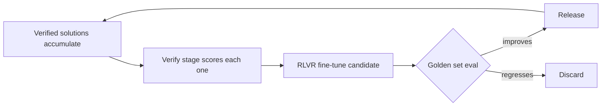

# Physics problem-solving engine — product brief (V2)

**To:** Prof. Sri, Prof. Nik
**From:** Jash, Product Lead — Medhavy
**Date:** July 20, 2026

*V2 revision — adds the "script-vs-LLM routing" section below, responding directly to Prof. Brown and Prof. Srinivas's review feedback on V1 (the determinism/routing requirement). This also carries a couple of housekeeping fixes from the same drafting pass as V1: Q2 is restored to a genuinely open question (a draft briefly had it marked "decided" based on a miscommunication on my end, not an actual call — fixed), and Q5/Q6 are filled in. If the version you already reviewed differs from this in some way that matters, flag it and I'll reconcile — the substantive addition here is the routing section.*

## Questions before I proceed

1. **Timeline** — An estimated timeline I should build this around?
2. **First surface** — solve mode (conversational textbook) or tutor mode first? That decides what gets built right after the core pipeline.
3. **Problem bank** — Do you already have a verified set of problems, with checked answers, from your courses? That's usually the slowest thing to assemble from scratch, and it changes my Phase 0 timeline.
4. **Build ownership** — Am I speccing this for an engineer to implement, or building it myself?
5. **Sign-off** — Sri, you're clearly the architecture reviewer here. Nik, do you also want to bless direction and resourcing before Phase 1 starts?
6. **Data governance** — Is there already a data processing agreement covering student data, including what the underlying model API sees during parse and plan? And does this need IRB review if outcomes feed a publication?

## System overview: how one question moves through everything

One pipeline produces one structured solution object. Three surfaces render that same object differently — full answer, progressive hints, or a comparison against a student's work. Every decision the pipeline makes also lands in an event log, which is what makes the four loops below possible without building a second system.

## What I'm proposing to build now (Phases 0–2)

Core idea: a standalone, stateless "physics problem-solving engine" — not a game-style physics engine — exposed as a tool that Medhavy calls. The LLM never does arithmetic or algebra itself; a symbolic/numeric solver (SymPy, SciPy, pint for units) handles computation while the LLM handles problem understanding, formula selection, and explanation. This follows your tier 1 (prompt + tool-use wrapper) and tier 2 (formula retrieval) recommendation directly. Tier 3 (fine-tuning / RLVR) is deliberately out of scope until we have evidence it's needed — it reappears below as the model loop.

### Pipeline workflow

- **Parse** turns the problem into knowns, unknowns, and units, each traceable back to the source text.
- **Retrieve** pulls candidate formulas from a curated knowledge base of cards (formula, applicability conditions, common pitfalls).
- **Plan** checks each candidate's conditions against the parsed problem and logs every assumption; a closure check confirms the system is solvable before anything is sent downstream, looping back to retrieve if it isn't.
- **Solve** executes the plan through symbolic/numeric tools only, never the LLM's own arithmetic.
- **Verify** checks units, limiting cases, and, where possible, an independent solution path.

### V2 addition — script-vs-LLM routing

Your review of V1 flagged a real gap: the brief never said how the pipeline decides, per problem, whether to trust the deterministic script alone or bring the LLM in — specifically flagging "the same problem producing different outputs" as the signal that the LLM needs to get involved. This section is that rule, plus a working prototype proving it holds up, not just a paragraph asserting it.

**The rule:** every call to the solver returns an explicit route, decided *before* solving, not after:

- **`deterministic_script`** — exactly one formula card's conditions are met. The answer is final and reproducible: the same input produces the same output every time, because SymPy has no randomness in it to begin with.
- **`ambiguous_multiple_deterministic_paths`** — more than one card's conditions are met for the same requested unknown. This is the literal "same problem, different outputs" case — two unrelated formulas both claim an answer. Rather than picking one silently, the pipeline surfaces every candidate's answer and routes to the LLM to arbitrate which formula actually fits the problem's context — not to redo the arithmetic.
- **`no_deterministic_path`** — nothing in the formula-card knowledge base covers this problem yet. The LLM handles it directly, and the miss is logged as a coverage gap for the curate loop rather than silently absorbed.

**Why this is the right rule and not just a compliant one:** SymPy can't produce different outputs for the same equations and the same numbers — there's no sampling inside a symbolic solve. So "the same problem, different outputs" can't come from the solver being unreliable. It can only come from *which formula gets selected* being unstable, or from the LLM doing part of the reasoning and sampling differently across calls. That's why the check isn't "solve it twice and diff" — that's expensive, and it would never catch anything on the script side — it's "before solving, does exactly one verified deterministic path exist for this problem?" That question is itself cheap and stable. It also matters beyond tidiness: grade mode needs two students with the identical problem graded against the identical reference solution, not whichever answer got sampled that day, and a wrong answer that comes with a route and a matched card is debuggable in a way an unrouted one isn't.

**Proof, not assertion:** the attached prototype runs this against all 16 Phase-0 golden-set problems — every answer matches, including cases needing a real simultaneous-equation solve (Atwood machine) and a physically-constrained root choice (spring energy, picking the positive branch out of a ±√ ambiguity). The same problem run 10 times back-to-back returns byte-identical output. And a constructed case — knowns that legitimately satisfy both a kinematics card and a spring-energy card for a shared unknown `v` — correctly returns both candidate answers (30.0 and 2.37) flagged for arbitration, instead of silently trusting whichever sorted first.

### Rough phasing

| Phase | Timeframe | Deliverable |
|---|---|---|
| 0 | Weeks 1–2 | Lock topic scope (proposing mechanics + E&M first), assemble a 150–300 problem golden set, baseline plain Claude/GPT chain-of-thought |
| 1 | Weeks 2–4 | MVP pipeline: LLM + SymPy/pint tool use, structured output, measured against baseline |
| 2 | Weeks 4–8 | Formula knowledge base + retrieval, verify stage, grade mode, expand to thermo/quantum |
| 3 | Conditional | Fine-tuning / RLVR — only if evals plateau below target |

Two risks to flag now: quantum is a weaker fit for symbolic solving than mechanics (SymPy's quantum tooling is thin), so QM tutoring will likely lean on curated worked derivations more than pure symbolic solving. And many real problems arrive as diagrams, so figure parsing is its own milestone with its own accuracy metric, separate from "solved correctly."

## Where this could go (roadmap — flagging for context, not asking for a decision)

Adding one thing to Phase 1 — the event log above — turns the pipeline's own output into the data source for four loops later. They compound in a specific order, each depending on the last.

North star for the roadmap: concepts mastered per student per week. Guardrail: golden-set accuracy must never regress as loops are added.

### Curate loop — build 1st

Every production failure becomes a coverage ticket instead of a silent gap. This has to exist before the other loops or they generate curation demand nobody can act on. Metric: syllabus coverage, time-to-new-card.

### Teach loop — build 2nd

Grading exhaust becomes teaching signal, and problem-linting for exam authors catches ambiguous or underdetermined questions before students see them. Instructors are the distribution channel, so winning them here unlocks scale for the loop below. Metric: remediation acceptance rate.

### Learn loop — build 3rd

The generator is the forward pipeline run in reverse: sample a weak spot, write a problem around it, and only ship it if verify passes — so every generated problem ships with a guaranteed answer key. Needs the curate and teach loops in place first, or it's personalizing on a thin knowledge base. Metric: learning gain per hour.

### Model loop — build 4th

This is tier 3 from your original note, deferred until the other loops generate enough verified data to make it worth the infrastructure. The golden set becomes the release gate: a fine-tuned model ships only when it beats the benchmark, never on hope. Metric: golden-set delta per round.

## Data & telemetry

Three of the four loops need data tied to an individual student to function at all: grade mode by definition, the event log's divergence records, and especially the learn loop's mastery model. The curate loop is the exception — it doesn't need student identity attached, and it's designed not to carry any. Every metric below maps to a specific decision or loop already in this brief, at the coarsest grain that still answers it, not collected because it was collectible. Explicitly out of scope: keystroke-level interaction logs, device or location fingerprinting, self-reported confidence surveys (a deliberate instrument, not background telemetry), and indefinite retention of a student's wrong-answer text tied to their name after a course ends.

Grades and graded work are education records under FERPA. Medhavy likely qualifies for the "school official" exception, but that comes with real limits: no reuse beyond the stated purpose, and every party touching the data — including whichever foundation model API handles parse, plan, and retrieve — needs to be covered by the same terms, which usually means its own agreement on retention and training use. If any of this feeds a publication, plausible given the UCL study Sri sent, that's likely IRB territory too, and worth starting early since review tends to move slowly. Both flagged as Q6 above rather than decided here.

| Metric | Powers | Identity | Starts |
|---|---|---|---|
| Query latency (time to solve) | Phase 0/1 eval budget, ongoing cost and performance monitoring | None | Phase 1 |
| Session length | Engagement health, learn-loop north-star denominator | Aggregate | Phase 1, once live in Medhavy |
| Questions per session | Weak-spot signal, only meaningful paired with resolution | Persistent | Raw count from Phase 1; paired signal once the learn loop ships |
| Mode split (solve / tutor / grade) | Resourcing for Phase 2 and beyond | None | Phase 2 |
| Re-plan rate (closure check sends back to retrieve) | Flags under-discriminating formula cards | None | Phase 2 |
| Verify-failure breakdown by check type | Where to invest engineering effort next | None | Phase 2 |
| Card usage rate | Which cards and topics carry the most weight | None | Phase 2 |
| Card rejection reasons, aggregated | Miswritten conditions vs. real coverage gaps | None | Phase 2 |
| Fallback rate (no card matched) | Denominator for the syllabus-coverage metric | None | Phase 2 |
| Verified (problem, solution) pair accumulation | Turns the tier-3 trigger into a number, not a guess | None | Phase 2 |
| Divergence-point distribution per assignment | The misconception dashboard's actual content | Aggregate* | Data from Phase 2; dashboard is roadmap |
| Problem-linting catch rate | The instructor-adoption wedge | None | Roadmap (teach loop) |
| Remediation → reassessment lift | Proves the loop improves outcomes, not just runs | Aggregate* | Roadmap (teach loop) |
| Hint depth to resolution | Sharper mastery signal than a raw question count | Persistent | Roadmap (learn loop) |
| Spaced-review success rate | Outcome measure for spaced review, which currently has none | Persistent | Roadmap (learn loop) |
| Session abandonment rate | Frustration early-warning, distinct from getting an answer wrong | Aggregate | Roadmap (learn loop) |
| Generated-problem first-pass verify rate | Health check on the generator before any student sees output | None | Roadmap (learn loop) |

*Aggregate: the underlying event necessarily carries identity for its primary purpose (grading), but the analytical view doesn't expose it.

A metric earns a row in this table before it earns a line of logging code.

## Decisions behind this plan

Seven calls in here are mine to defend, not stakeholder questions — worth being explicit about the reasoning and what would actually change it, rather than holding these as fixed opinions.

| Decision | Why | What would change it |
|---|---|---|
| Stateless service both products call, not logic embedded per-product | Model-agnostic, independently testable, one place for accuracy regressions to show up | If integration overhead outweighs the benefit — a real cost, not a reason to default to duplication |
| LLM never computes; SymPy/SciPy/pint do all arithmetic and algebra | Directly fixes the silent algebra-error failure mode every paper on Sri's list flags | Close to a design principle, not really up for debate short of the tool layer itself proving unreliable |
| Mechanics + E&M first, not quantum | Strongest symbolic-tooling fit, fastest credible demo, most existing benchmark coverage to build a golden set from | If tutor mode's near-term need turns out to be QM-specific, I'd scope a narrower, more hand-curated QM slice rather than delay launch |
| Tier 3 (fine-tuning / RLVR) deferred | Needs a large verified problem set to reward against, which doesn't exist yet | Phase 2 evals plateauing clearly below target with full KB coverage — that's the trigger, and I'd want to see it in the data first |
| Curate → Teach → Learn → Model sequencing | Each loop needs data or trust the last one built; the risk is personalizing on an unvalidated KB | If instructor adoption is slower to win than KB coverage, I'd run curate and teach in parallel instead of strictly in sequence |
| Telemetry scoped to named decisions, not exhaustive collection | Over-collection compounds the FERPA and IRB exposure above and risks eroding the student trust the tutor depends on, without sharpening any decision | If a new decision or loop needs a metric not listed here, I'd add it then, with its own row — not preemptively |
| Route on "exactly one deterministic path exists" rather than "run it twice and diff" | SymPy has no randomness, so re-running the script can't surface instability — only formula-selection ambiguity or LLM sampling can. Checking that before solving is both cheaper and catches the actual failure mode | If the knowledge base grows to where "exactly one card matches" stops reliably meaning "unambiguous" (systematically overlapping cards), I'd add semantic tagging per output variable rather than trusting card-count alone |

## Plan vs. reality, tracked as we go

| Date | Planned | Actual | Why it differed | What we changed |
|---|---|---|---|---|
| Jul 19, 2026 | Phase 0 starts: lock scope, assemble golden set, baseline current models | — | — | — |
| Week of Jul 20–27, 2026 | Get sign-off on Q1–6, kick off Phase 0 | V1 went to Prof. Brown and Prof. Srinivas; their feedback centered on a pipeline design gap (script-vs-LLM routing) rather than signing off on the six questions | Reviewers prioritized a structural correctness issue over the scoping questions | Built the routing rule as an explicit, testable rule (new section above) plus a working prototype, rather than re-sending V1 unchanged |
